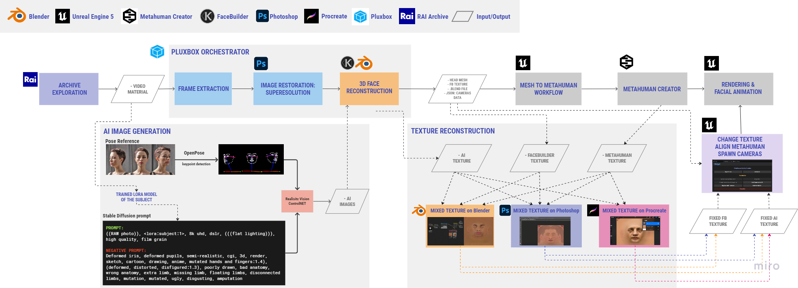
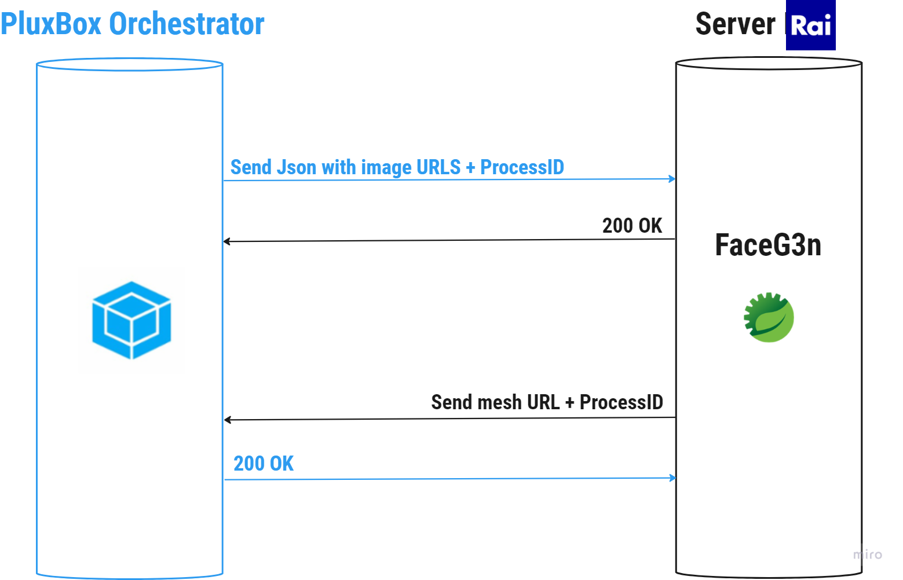
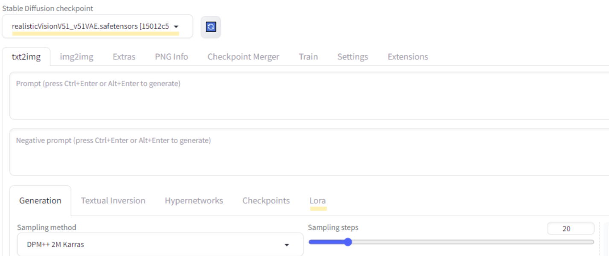
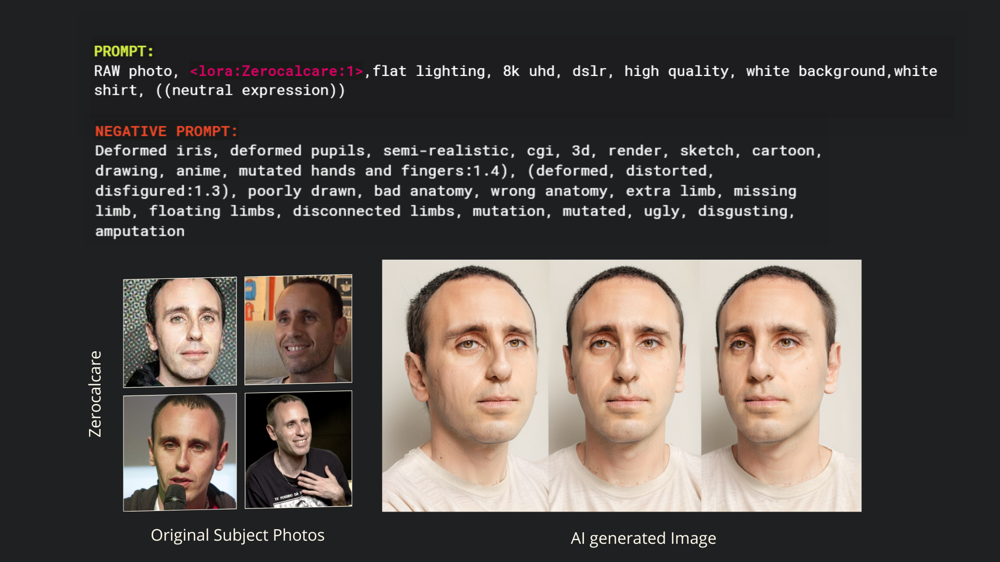
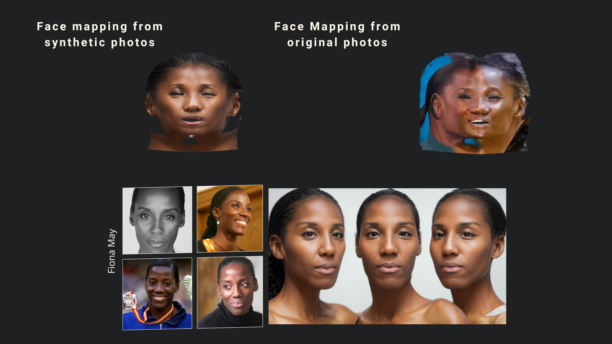

<br/>
<p align="center">
  <h1 align="center">Automatic Workflow Optimization for Photorealistic Synthetic Humans Creation
</h1>

</p>

 

## Table Of Contents

* [About the Project](#about-the-project)
  * [Automated 3D Head Reconstruction](#automated-3D-head-reconstruction)
  * [Facial Texture Reconstruction](#facial-texture-reconstruction)
* [Built With](#built-with)
* [Getting Started](#getting-started)
  * [Prerequisites](#prerequisites)
  * [Installation](#installation)
* [Usage](#usage)
* [License](#license)
* [Authors](#authors)
* [Acknowledgements](#acknowledgements)

## About The Project



The primary goal was to develop and implement an advanced workflow for Synthetic Human generation, with a focus on minimizing human intervention and ensuring an efficient, flexible process. 
This project aimed to transform RAI’s vast archive of images and videos resources into a valuable asset for creating photorealistic 3D avatars of significant personalities, such as historical figures or past celebrities.

## Automated 3D Head Reconstruction

This achievement is attributed to the Orchestrator, a cutting-edge technological tool developed in collaboration with PluxBox for the IBC2023 Accelerator Project. The Orchestrator seamlessly integrates multiple stages, ranging from image selection to super-resolution, ultimately leading to the reconstruction of a three-dimensional face. If you're curious to witness this innovative process in action, check out our [demo](https://www.youtube.com/watch?v=HkRWnIfsjuE).

## Automation through FaceBuilder and Python Script

The automation in face reconstruction is made possible by a Python script named ["FB_Head_Reconstruction_Automatized.py"](./FB_Head_Reconstruction_Automatized.py). Leveraging the powerful features of Blender's FaceBuilder plugin, this script allows to generate a 3D model of the face from 2D images.

#### Prerequisites for Script Execution

Before executing the script, ensure you have the following prerequisites:
* [Blender](https://www.blender.org/download/) installed
* A valid license for the [FaceBuilder plugin](https://keentools.io/products/facebuilder-for-blender)

#### Running the Script

Once you have Blender and FaceBuilder installed, it's possible execute the script from the command line using the following command:

```bash
blender -b -P "path\FB_Head_Reconstruction_Automatized.py" -- "path\imgs"
```
Replace "path\FB_Head_Reconstruction_Automatized.py" with the path of the script and "path\imgs" with the directory containing the 2D images needed for the script.

### Integration with Orchestrator using FaceG3n
To integrate the script into the Orchestrator, a REST API service named FaceG3n was developed and deployed on a Linux-based Rai server, ensuring efficient communication and coordination between the Orchestrator and the 3D head creation script.
<p align="center">
  
</p>


## Facial Texture Reconstruction
The project also explores improving textures using Generative AI to produce images of the reference subject. AI-generated images were found to be more suitable for texture production than traditional methods. This phase benefited from the refinement of LoRA training models, enabling the creation of realistic, detailed images crucial for generating uniform textures in Synthetic Human creation.


## Built With

Major Frameworks Utilized in the Project:

* [Automatic1111's Stable Diffusion Web UI](https://github.com/AUTOMATIC1111/stable-diffusion-webui)
* [LoRA Model Training](https://colab.research.google.com/github/Linaqruf/kohya-trainer/blob/main/kohya-LoRA-dreambooth.ipynb)
* [Realistic Vision V5.1 Checkpoint](https://civitai.com/models/4201/realistic-vision-v51)
* [ControlNet openpose](https://huggingface.co/lllyasviel/sd-controlnet-openpose)

## Getting Started for Facial Texture Reconstruction

Through the [Stable Diffusion Web UI](https://github.com/AUTOMATIC1111/stable-diffusion-webui) provided by Automatic1111 it is possible to [download](https://stable-diffusion-art.com/install-windows/) and run Stable Diffusion locally.

The Low-Rank Adaptation training was conducted using the [Kohya Trainer](https://colab.research.google.com/github/Linaqruf/kohya-trainer/blob/main/kohya-LoRA-dreambooth.ipynb). 
Approximately 80 images of the chosen subject were used for the training, the parameters used can be found in this [video](https://youtu.be/HUPcr5njxkM?si=7dc1U9Na0rhPvnWw&t=183). 

After training the LoRA models using the Kohya Trainer, the resulting tensorflow files of the subject generated were directly integrated into the local installation of the Stable Diffusion Web UI in the _"stable-diffusion-webui/models/Lora"_ directory, enabling the usage of these custom-trained models in the SD WebUI in the LoRA tab.

The Realistic Vision V5.1 model is specifically designed and optimized for generating high-resolution, photorealistic images. This model is a critical component in achieving high-quality images of the desired subject, and it functions within the stable diffusion framework, once downloaded, the model file needs to be placed in the _"stable-diffusion-webui/models/Stable-diffusion"_ directory.
Once the Web UI recognizes the new model, you can select it from the Stable Diffusion checkpoint input field.



ControlNet is a neural network structure that significantly enhances the capabilities of large, pretrained text-to-image diffusion models like Stable Diffusion.
By adding spatial conditioning controls, it allows for more specific and controlled image generation.
In combination with OpenPose, is it possible to have specific pose estimation in the output images. OpenPose detects human keypoints from the driving images, providing an extra external condition for the SD model alongside the text prompt.
To install ControlNet's extension on the Stable diffusion WEB UI and the OpenPose Model File follow this installation [guide](https://stable-diffusion-art.com/controlnet/). 


### Prerequisites
The minimum Stable Diffusion system requirements before you begin:
- Nvidia Graphics Card
- 6.9GB VRAM
- 10GB Hard Drive
- 8GB Memory (RAM)
--------------------------------------

## Facial Texture Reconstruction Usage Instructions
After fine-tuning a model on your specific subject using the LoRA technique and placing it in the designated folder, follow these steps to generate high-quality images of the _subject_

1. Configure "Realistic Vision" as your Stable Diffusion Checkpoint
2. Choose the subject file from the LoRA tab
3. Paste the input Prompts:
* Prompt 
```sh
<lora:subject:1>, RAW photo, flat lighting, 8k uhd, dslr, high quality, white background, white t-shirt, neutral expression
```
* Negative Prompt 
```sh
(deformed iris, deformed pupils, semi-realistic, cgi, 3d, render, sketch, cartoon, drawing, anime, mutated hands and fingers:1.4), (deformed, distorted, disfigured:1.3), poorly drawn, bad anatomy, wrong anatomy, extra limb, missing limb, floating limbs, disconnected limbs, mutation, mutated, ugly, disgusting, amputation
```
3. Adjust these parameters based on your specific needs:
* Sampling method: Euler A or DPM++ SDE Karras
* Sampling steps: 20 - 30
* CFG Scale: 3,5 - 7
* Hires. fix: Lanczos
* Upscale: 1.1
* Denoising strength: 0.25-0.45

4. In the ControlNet section upload a driving image of the pose you want your subject to assume. [guide](https://learn.thinkdiffusion.com/controlnet-openpose/)
 * Check Pixel Perfect Box
 * Control Type: OpenPose
 * Preprocessor: openpose_face
 * Model: control_v11p_sd15_openpose
   
5.Generate!




## Authors

* **Valeria Valentini** 
* **Miriana Martini** 
