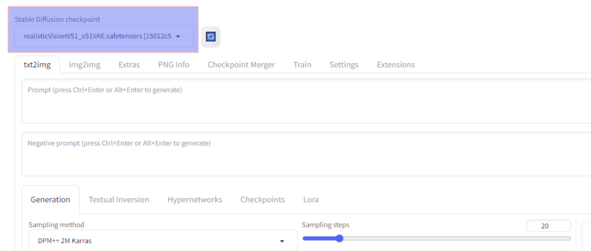

<br/>
<p align="center">
  <h1 align="center">Automatic Workflow Optimization for Photorealistic Synthetic Humans Creation
</h1>

</p>

 

## Table Of Contents

* [About the Project](#about-the-project)
* [Built With](#built-with)
* [Getting Started](#getting-started)
  * [Prerequisites](#prerequisites)
  * [Installation](#installation)
* [Usage](#usage)
* [License](#license)
* [Authors](#authors)
* [Acknowledgements](#acknowledgements)

## About The Project


The primary goal was to develop and implement an advanced workflow for Synthetic Human generation, with a focus on minimizing human intervention and ensuring an efficient, flexible process. 
This project aimed to transform RAI’s vast archive of images and videos resources into a valuable asset for creating photorealistic 3D avatars of significant personalities, such as historical figures or past celebrities.

<p align="center">
  <h3>Automated 3D Head Reconstruction
</h3>
</p>
This was achieved through the Orchestrator, developed in partnership with PluxBox for the IBC2023 Accelerator Project. The Orchestrator is a sophisticated technological tool that integrates various stages - from image selection to super-resolution, culminating in three-dimensional face reconstruction. Automation in Face Reconstruction was facilitated by a script provided to the Orchestrator via Rest APIs, employing Blender FaceBuilder plugin's functionalities to create 3D face meshes from 2D images.

<p align="center">
  <h3>Face Texture Reconstruction
</h3>
</p>
The project also explores improving textures using Generative AI to produce images of the reference subject. AI-generated images were found to be more suitable for texture production than traditional methods. This phase benefited from the refinement of LoRA training models, enabling the creation of realistic, detailed images crucial for generating uniform textures in Synthetic Human creation.


## Built With

Major Frameworks Utilized in the Project:

* [Automatic1111's Stable Diffusion Web UI](https://github.com/AUTOMATIC1111/stable-diffusion-webui)
* [LoRA Model Training](https://colab.research.google.com/github/Linaqruf/kohya-trainer/blob/main/kohya-LoRA-dreambooth.ipynb)
* [Realistic Vision V5.1 Checkpoint](https://civitai.com/models/4201/realistic-vision-v51)
* [ControlNet openpose](https://huggingface.co/lllyasviel/sd-controlnet-openpose)

## Getting Started

Through the [Stable Diffusion Web UI](https://github.com/AUTOMATIC1111/stable-diffusion-webui) provided by Automatic1111 it is possible to [download](https://stable-diffusion-art.com/install-windows/) and run Stable Diffusion locally.

The Low-Rank Adaptation training was conducted using the [Google Colab training](https://colab.research.google.com/github/Linaqruf/kohya-trainer/blob/main/kohya-LoRA-dreambooth.ipynb). 
Approximately 80 images of the chosen subject were used for the training, the parameters used can be found in this [video](https://youtu.be/HUPcr5njxkM?si=7dc1U9Na0rhPvnWw&t=183)
After training the LoRA models using the Kohya Trainer, the resulting tensorflow files of the subject generated were directly integrated into the local installation of the Stable Diffusion Web UI in the _"stable-diffusion-webui/models/Lora"_ directory, enabling the usage of these custom-trained models in the SD WebUI.

The Realistic Vision V5.1 model is specifically designed and optimized for generating high-resolution, photorealistic images. This model is a critical component in achieving high-quality images of the desired subject, and it functions within the stable diffusion framework, once downloaded, the model file needs to be placed in the _"models/Stable-diffusion"_ directory the local installation of the Stable Diffusion Web UI.
Once the Web UI recognizes the new model, you can select it from the Stable Diffusion checkpoint input field.



ControlNet is a neural network structure that significantly enhances the capabilities of large, pretrained text-to-image diffusion models like Stable Diffusion.
By adding spatial conditioning controls, it allows for more specific and controlled image generation.
In combination with OpenPose, is it possible to have specific pose estimation in the output images. OpenPose detects human keypoints from the driving images, providing an extra external condition for the SD model alongside the text prompt.
To install ControlNet's extension on the Stable diffusion WEB UI and the OpenPose Model File follow this installation [guide](https://stable-diffusion-art.com/controlnet/)


### Prerequisites
The minimum Stable Diffusion system requirements before you begin:
- Nvidia Graphics Card
- 6.9GB VRAM
- 10GB Hard Drive
- 8GB Memory (RAM)
--------------------------------------

* npm

```sh
npm install npm@latest -g
```

### Installation

1. Get a free API Key at [https://example.com](https://example.com)

2. Clone the repo

```sh
git clone https://github.com/your_username_/Project-Name.git
```

3. Install NPM packages

```sh
npm install
```

4. Enter your API in `config.js`

```JS
const API_KEY = 'ENTER YOUR API';
```

## Usage


## License

Distributed under the MIT License. See [LICENSE](https://github.com/valeValentini/SyntheticHumans_CRR/blob/main/LICENSE.md) for more information.

## Authors

* **Valeria Valentini** 
* **Miriana Martini** 

## Acknowledgements

* [ShaanCoding](https://github.com/ShaanCoding/)
* [Othneil Drew](https://github.com/othneildrew/Best-README-Template)
* [ImgShields](https://shields.io/)
